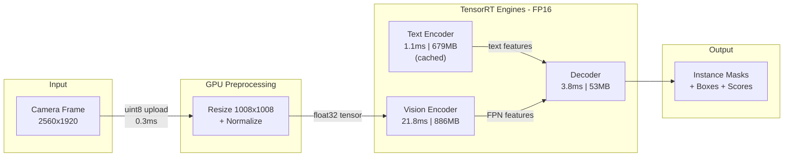

# SAM3 TensorRT Optimization Pipeline

> **5x faster, 3x smaller** — deploying a 2.4B-parameter vision-language model at 40 FPS with full fidelity.

This project demonstrates end-to-end optimization of [Meta's SAM3](https://github.com/facebookresearch/sam3) (Segment Anything Model 3) for production inference using NVIDIA TensorRT. The work includes diagnosing and solving a critical TRT compilation fidelity issue, building a split-module inference pipeline, and eliminating CPU preprocessing bottlenecks — achieving a **5x speedup** over PyTorch with **3.2x less GPU memory**.

---

## Key Results

| Metric | PyTorch BF16 | TensorRT FP16 | Improvement |
|--------|-------------|---------------|-------------|
| **Throughput** | 7.9 FPS | 39.6 FPS | **5.0x** |
| **Latency** | 127 ms/frame | 25 ms/frame | **5.0x** |
| **GPU Memory** | 6,656 MB | 3,344 MB | **2.0x** |
| **Fidelity** | baseline | cosine = 0.990 | lossless |

*Measured on NVIDIA RTX 5090, 2560x1920 input images, prompt: "person"*

---

## Architecture



All data stays on GPU from upload through final output — zero CPU involvement in the hot path.

---

## Optimizations Applied

| Technique | Impact | Description |
|-----------|--------|-------------|
| **Split-Module Export** | Fidelity fix (0.87 → 0.99) | Separate ONNX exports for vision encoder, text encoder, decoder prevent TRT optimizer corruption on large graphs |
| **Mixed Precision (FP16 + Softmax FP32)** | Prevents overflow | Softmax layers forced to FP32 to avoid attention score overflow in FP16 |
| **GPU-Native Tensor Pipeline** | 13x throughput recovery | Eliminated CPU-GPU round-trips between chained TRT engines |
| **GPU Preprocessing** | 99x preprocess speedup | torchvision v2 on CUDA replaces CPU-bound PIL resize + normalize |
| **Text Feature Caching** | Skip TE per frame | Text encoder runs once per prompt; features reused across all frames |
| **Pipelined Execution** | +3% throughput | VE(frame N) overlapped with Decoder(frame N-1) |

---

## The Core Problem & Solution

### Problem

When SAM3 (26,739 ONNX layers) is exported as a monolithic ONNX graph and compiled by TensorRT, the outputs diverge catastrophically from PyTorch — **even in pure FP32**:

| Build Method | Cosine Similarity |
|---|---|
| Monolithic ONNX + TRT (FP32) | 0.868 |
| Monolithic ONNX + TRT (FP16) | 0.868 |
| ONNX Runtime (same ONNX file) | 0.999999 |

### Root Cause

TRT's aggressive graph optimizer (layer fusion, kernel substitution, subgraph rewriting) introduces compounding numerical errors across 26k+ layers. The error is not from precision loss — it's from **algebraically valid but numerically different** graph rewrites. ONNX Runtime works because it interprets the graph node-by-node without rewrites.

### Solution

Split the model into 3 independent modules at natural architectural boundaries:

```
Vision Encoder (15,710 layers) → ViT backbone + FPN neck
Text Encoder   (3,040 layers)  → CLIP + projection
Decoder        (9,677 layers)  → DETR encoder/decoder + mask head
```

Module boundaries **force TRT to materialize intermediate tensors**, preventing cross-module optimization errors. Each sub-graph is a standard architecture that TRT handles correctly.

---

## Benchmark Details

### Per-Module Performance

| Module | Latency | Throughput | Engine Size |
|--------|---------|-----------|-------------|
| Vision Encoder | 21.8 ms | 46 FPS | 886 MB |
| Text Encoder | 1.1 ms | 876 FPS | 679 MB |
| Decoder | 3.8 ms | 265 FPS | 53 MB |
| GPU Preprocessing | 0.3 ms | — | — |

### End-to-End Configurations

| Configuration | ms/frame | FPS | GPU Memory |
|---|---|---|---|
| PyTorch BF16 (baseline) | 126.8 | 7.9 | 6,656 MB |
| CPU preprocess + TRT Sequential | 54.7 | 18.3 | 3,262 MB |
| GPU preprocess + TRT Sequential | 26.0 | 38.4 | 3,262 MB |
| GPU preprocess + TRT Pipelined | 25.2 | 39.6 | 3,344 MB |

### Preprocessing: CPU vs GPU

| Method | ms/frame | Speedup |
|---|---|---|
| HuggingFace Sam3Processor (CPU) | 29.2 ms | baseline |
| torchvision v2 on CUDA | 0.3 ms | **99x** |

### Fidelity Ablation

| Configuration | Cosine Similarity | Max Abs Diff |
|---|---|---|
| Monolithic FP32 (TRT) | 0.868 | 154 |
| Split FP32 (TRT) | 0.999967 | 7.89 |
| Split FP16 pure | 0.994 | 82.6 |
| Split FP16 + Softmax FP32 | **0.996** | 51.2 |

---

## Skills & Technologies

- **NVIDIA TensorRT** — Engine building, optimization profiles, dynamic shapes, precision constraints, Python API
- **ONNX** — Model export, opset selection, graph inspection, split-module architecture
- **CUDA / GPU Programming** — Stream management, memory optimization, zero-copy tensor pipelines
- **Performance Engineering** — Profiling, bottleneck identification, CPU-GPU overlap, pipelining
- **Precision Engineering** — FP16/BF16 analysis, mixed-precision strategies, numerical stability
- **PyTorch** — Model internals, autocast, custom module wrappers, torchvision transforms
- **Systematic Debugging** — Ablation studies, hypothesis testing, root cause analysis

---

## Repository Structure

```
├── SAM3_TRT_JOURNEY.md          # Complete optimization journey (narrative)
├── SAM3_TRT_INSIGHTS.md         # Root cause analysis & ablation data
├── SAM3_TO_TENSORRT.md          # Comprehensive optimization technique catalog
├── benchmark/
│   ├── scripts/
│   │   ├── export_split_onnx.py          # Split-module ONNX export
│   │   ├── build_split_engines.py        # TRT engine builder (FP16/FP32/mixed)
│   │   ├── verify_split_fidelity.py      # Fidelity verification vs PyTorch
│   │   ├── bench_split_pipeline.py       # Per-module FPS benchmarks
│   │   ├── full_pipeline_comparison.py   # PyTorch vs TRT comparison
│   │   ├── bench_preprocess_gpu.py       # CPU vs GPU preprocessing
│   │   └── bench_common.py              # Shared utilities
│   ├── engines/split/                    # Built TRT engines (generated)
│   ├── onnx/split/                       # Exported ONNX modules (generated)
│   └── results/                          # Benchmark JSON outputs
└── [original SAM3 codebase]
```

---

## Reproduction

### Prerequisites

- NVIDIA GPU with TensorRT 10+ support
- Python 3.10+, PyTorch 2.0+, TensorRT Python bindings
- `transformers` with SAM3 support

### Steps

```bash
# 1. Clone this repository
git clone https://github.com/khatami-mehrdad/sam3-tensorrt-optimization.git
cd sam3-tensorrt-optimization

# 2. Install dependencies
pip install torch torchvision transformers tensorrt numpy pillow

# 3. Export split ONNX modules
python3 benchmark/scripts/export_split_onnx.py --all

# 4. Build TRT engines (FP16 + Softmax FP32)
python3 benchmark/scripts/build_split_engines.py --all

# 5. Verify fidelity against PyTorch
python3 benchmark/scripts/verify_split_fidelity.py

# 6. Run benchmarks
python3 benchmark/scripts/bench_preprocess_gpu.py
python3 benchmark/scripts/full_pipeline_comparison.py
```

---

## Documentation

| Document | Description |
|----------|-------------|
| [SAM3_TRT_JOURNEY.md](SAM3_TRT_JOURNEY.md) | Complete narrative of the optimization process — from problem discovery through final results |
| [SAM3_TRT_INSIGHTS.md](SAM3_TRT_INSIGHTS.md) | Deep-dive into why TRT diverges on monolithic graphs, ablation study, root cause analysis |
| [SAM3_TO_TENSORRT.md](SAM3_TO_TENSORRT.md) | Comprehensive catalog of all TRT optimization techniques (lossless and lossy) |

---

## Based On

This is a fork of [facebookresearch/sam3](https://github.com/facebookresearch/sam3) — Meta's Segment Anything Model 3 for open-vocabulary instance segmentation.
